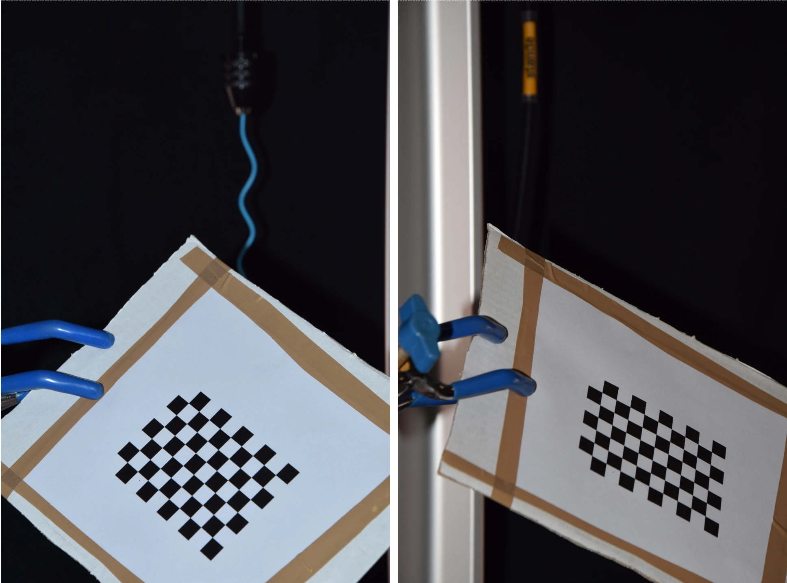
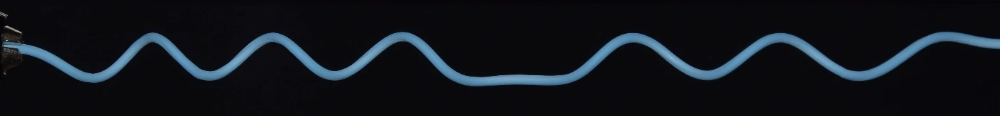

# Stereo Camera Calibration and Filament Reconstruction

This document describes the process of calibrating two cameras and using them to reconstruct the 3D geometry of a filamentary object. The approach relies on [OpenCV's](https://docs.opencv.org/4.x/d9/db7/tutorial_py_table_of_contents_calib3d.html) built-in functions for camera calibration, stereo calibration, and triangulation.


##### Figure : 3D reconstruction of the writhing experiment. 

<div style="display: flex; justify-content: center;">
  
</div>


<div style="display: flex; justify-content: center;">
  
</div>


## Table of Contents
- [Overview of the method](#overview-of-the-method)
- [Stereo Camera Calibration](#stereo-camera-calibration)
  - [Method](#method)
  - [Intrinsic Calibration](#step-1-intrinsic-calibration-of-each-camera)
  - [Stereo Calibration](#step-2-stereo-calibration-of-the-camera-pair)
  - [Output](#output)
- [Extraction of object centerline on each photo](#extraction-of-filament-centerline-from-images)
- [Reconstruction of 3D centerline](#reconstruction-of-3d-centerline)
- [Example of usage](#example-of-usage)


## Overview of the method

In order to reconstruct the 3D geometry of a filamentary object, two cameras can be positioned at a fixed angle relative to each other to capture simultaneous views of the scene. Camera calibration is performed using printed checkerboards together with built-in functions from the Python library OpenCV.

The intrinsic parameters of each camera are obtained from a set of calibration images with the function cv.calibrateCamera. From a series of checkerboard images visible to both cameras, the rotation matrix (R), translation vector (T), and fundamental matrix (F) describing the stereo geometry are then computed using OpenCV’s cv.stereoCalibrate.

Within the overlapping field of view of the two cameras, the filamentary object appears as a narrow feature. Its centerline can be extracted in each image by detecting the filament edges and determining the midpoint along the normal direction. This yields a 2D representation of the centerline in both camera planes.

To establish correspondence between the two views, epipolar geometry is exploited through the OpenCV function cv.computeCorrespondEpilines. Since the filament is a one-dimensional structure and the cameras are fixed, the epipolar lines intersect the curve in the second image at a unique point, ensuring robust matching.

Finally, using the calibration parameters, the fundamental matrix, and the 2D centerline coordinates from both images, the 3D centerline of the filament is reconstructed in the laboratory frame with OpenCV’s cv.triangulatePoints.


---

## Stereo Camera Calibration

To enable 3D reconstruction of the rod, the two Nikon® 3300 cameras were first calibrated using a printed checkerboard pattern. The stereo calibration step provides the intrinsic and extrinsic parameters needed for stereo matching and triangulation.

### Method

1. **Intrinsic Calibration**  
   Each camera was individually calibrated using approximately one hundred checkerboard images. This yielded the intrinsic matrices `K0` and `K7`, as well as the distortion coefficients `d0` and `d7`. The calibration was performed with the OpenCV function `cv.calibrateCamera`.

2. **Stereo Calibration**  
   A second set (approximately a hundred couple ) of checkerboard images visible by both cameras was then used to compute the relative orientation of the two cameras. Using the OpenCV function `cv.stereoCalibrate`, the following parameters were extracted:
   - Rotation matrix `R`  
   - Translation vector `T`  
   - Essential matrix `E`  
   - Fundamental matrix `F`  

   These parameters establish the geometric relationship between the two cameras, enabling epipolar geometry and 3D reconstruction.


Exemple of checkerboard visible on both photos taken with two Nikon® 3300 cameras: 
<p align="center">
  
</p>

### Implementation
#### Step 1: Intrinsic Calibration of Each Camera

The following script computes the intrinsic parameters of a single camera using a series of checkerboard images. It saves the intrinsic matrix `K` and distortion coefficients `x` for later stereo calibration.

```python
import numpy as np
import cv2 as cv
import glob

# termination criteria
criteria = (cv.TERM_CRITERIA_EPS + cv.TERM_CRITERIA_MAX_ITER, 30, 0.001)
chessboard_size = (9,6)

# prepare object points, like (0,0,0), (1,0,0), ..., (8,5,0)
objp = np.zeros((np.prod(chessboard_size),3),dtype=np.float32)
objp[:,:2] = np.mgrid[0:chessboard_size[0], 0:chessboard_size[1]].T.reshape(-1,2)

# Arrays to store object points and image points from all the images.
objpoints = [] # 3d point in real world space
imgpoints = [] # 2d points in image plane
img_array = []

images = glob.glob('*.jpg')
for fname in images:
    img = cv.imread(fname)
    img_array.append(img)

for img in img_array:
    gray = cv.cvtColor(img, cv.COLOR_BGR2GRAY)
    ret, corners = cv.findChessboardCorners(gray, chessboard_size, flags=cv.CALIB_CB_FAST_CHECK)
    if ret == True:
        objpoints.append(objp)
        corners2 = cv.cornerSubPix(gray, corners, (11,11), (-1,-1), criteria)
        imgpoints.append(corners2)

ret, mtx, dist, rvecs, tvecs = cv.calibrateCamera(objpoints, imgpoints, gray.shape[::-1], None, None)
print(mtx, dist)

np.save('K_camera.npy', mtx)
np.save('x_camera.npy', dist)
```

This calibration is performed independently for each camera (e.g., Camera 0 and Camera 7). The outputs are then used in the stereo calibration stage.

---

#### Step 2: Stereo Calibration of the Camera Pair

Once each camera is intrinsically calibrated, stereo calibration is performed to compute the relative pose between the two cameras.

```python
import numpy as np
import cv2 as cv
import glob

images0 = sorted(glob.glob('Appareil 0/*.jpg'))
images7 = sorted(glob.glob('Appareil 7/*.jpg'))

criteria = (cv.TERM_CRITERIA_EPS + cv.TERM_CRITERIA_MAX_ITER, 30, 0.001)
chessboard_size = (9,6)

# prepare object points
objp = np.zeros((np.prod(chessboard_size),3),dtype=np.float32)
objp[:,:2] = np.mgrid[0:chessboard_size[0], 0:chessboard_size[1]].T.reshape(-1,2)
objpoints = [] 
imgpoints0 = []
imgpoints7 = []  

# Load intrinsic parameters
K0 = np.load('Appareil 0/K_0.npy')
K7 = np.load('Appareil 7/K_7.npy')
d0 = np.load('Appareil 0/x_0.npy')
d7 = np.load('Appareil 7/x_7.npy')

img_array0, img_array7 = [], []

for fname in images0:
    img_array0.append(cv.imread(fname))

for fname in images7:
    img_array7.append(cv.imread(fname))

for y in range(len(img_array0)):
    gray0 = cv.cvtColor(img_array0[y], cv.COLOR_BGR2GRAY)
    gray7 = cv.cvtColor(img_array7[y], cv.COLOR_BGR2GRAY)

    ret7, corner7 = cv.findChessboardCorners(gray7, chessboard_size, flags=cv.CALIB_CB_FAST_CHECK)
    if ret7:
        ret0, corner0 = cv.findChessboardCorners(gray0, chessboard_size, flags=cv.CALIB_CB_FAST_CHECK)
        if ret0:
            objpoints.append(objp)
            imgpoints0.append(corner0)
            imgpoints7.append(corner7)

ret, K7, d7, K0, d0, R, T, E, F = cv.stereoCalibrate(
    objpoints, imgpoints7, imgpoints0, K7, d7, K0, d0, gray0.shape[::-1], None, None
)

print("Rotation Matrix R:\n", R)
print("Translation Vector T:\n", T)
print("Fundamental Matrix F:\n", F)

np.save('fundamentalmatrix.npy', F)
np.save('rotationmatrix.npy', R)
np.save('transvec.npy', T)
```

This step yields the stereo calibration parameters, which are essential for reconstructing 3D geometry from 2D projections.


### Output

- **Rotation matrix (R):** describes the relative orientation between the two cameras.  
- **Translation vector (T):** defines the baseline distance and direction between the cameras.  
- **Fundamental matrix (F):** encodes epipolar geometry, ensuring that corresponding points in one image map to epipolar lines in the other.  

These matrices were stored for subsequent **pose estimation** and **3D reconstruction** of the rod.

---


## Extraction of Filament Centerline from Images

This section describes the method used to extract the **2D centerline** of a filamentary object from photographs taken with one of the cameras in a stereo setup. The extracted 2D centerlines from both cameras are later used for **3D reconstruction**.  

The approach relies on:  
1. **Color thresholding in HSV space** to isolate the filament.  
2. **Manual selection** of start and end points of the filament by user clicks.  
3. **Boundary detection** of left and right edges.  
4. **Iterative midpoint calculation** between the two boundaries to estimate the filament centerline.  
5. **Saving results** in CSV format for later use in 3D reconstruction.  

---

Exemple of object to extract centerline : 
<p align="center">
  
</p>

---

### Method

#### Step 1: Preprocessing
- Images are resized and converted to HSV color space.  
- A binary mask is generated using color thresholding, isolating the filament pixels from the background.  

#### Step 2: Manual Initialization
- The user clicks on the **start** and **end** points of the filament in the binary mask.  
- A correction step ensures the starting point lies approximately in the center of the filament, even if the click was slightly off.  

#### Step 3: Edge Detection
- The left and right boundaries of the filament are detected at each row (`y`) of the image.  
- The midpoint between the two edges is computed and stored as the **centerline coordinate**.  

#### Step 4: Centerline Extraction
- The process iterates from the starting row to the ending row.  
- For each row:
  - Left and right edge coordinates are found.  
  - The center point between them is appended to the centerline.  

#### Step 5: Output
- The computed **centerline coordinates** are stored in `.csv` files for each processed image.  
- These files are later used during stereo triangulation to reconstruct the **3D centerline**.  

---

### Python Implementation

```python
import cv2
import numpy as np
import glob

# Global storage for clicked points
refPt = []
lestcoord = []

def click_event(event, x, y, flags, param):
    """
    Mouse callback function to store clicked coordinates.
    Left click = start/end points of filament
    Right click = debug RGB values
    """
    global lestcoord
    if event == cv2.EVENT_LBUTTONDOWN:
        print(x, ",", y)
        refPt.append([x, y])
        lestcoord.append([x, y])
        cv2.imshow("image", param)

    if event == cv2.EVENT_RBUTTONDOWN:
        blue, green, red = param[y, x]
        print("BGR:", blue, green, red)
        cv2.imshow("image", param)

def process_image(fname, hsv_lower=(70, 0, 70), hsv_upper=(255, 230, 255), first_image=True):
    """
    Process a single image to extract the centerline of the filament.
    """
    img = cv2.imread(fname)
    img = cv2.resize(img, (img.shape[1], img.shape[0]), interpolation=cv2.INTER_AREA)

    # Convert to HSV and threshold
    hsv = cv2.cvtColor(img, cv2.COLOR_BGR2HSV)
    mask = cv2.inRange(hsv, hsv_lower, hsv_upper)

    global lestcoord
    if first_image:
        cv2.imshow("image", mask)
        cv2.setMouseCallback("image", click_event, mask)
        cv2.waitKey(0)
        cv2.destroyAllWindows()

    try:
        x_0, y_0 = lestcoord[0]
        x_f, y_f = lestcoord[1]

        # Correct starting point to filament center
        h = hp = o = op = 0
        while mask[y_0, x_0 - h] == 255: h += 1
        while mask[y_0, x_0 + hp] == 255: hp += 1
        while mask[y_0 - o, x_0] == 255: o += 1
        while mask[y_0 + op, x_0] == 255: op += 1

        if min(h+hp, o+op) == h+hp:
            x_0 = int(x_0 + (hp-h)/2)
        else:
            y_0 = int(y_0 + (op-o)/2)

        # Edge and centerline tracking
        edges = mask
        leftz0 = complex(x_0 - h, y_0)
        rightz0 = complex(x_0 + hp, y_0)
        x_init = int((np.real(leftz0) + np.real(rightz0)) * 0.5)

        Zcurvefin = []
        for pixy in range(y_0, y_f+1):
            ind_left = ind_right = 0
            while edges[pixy, x_init - ind_left] == 255: ind_left += 1
            while edges[pixy, x_init + ind_right] == 255: ind_right += 1
            x_init = int((x_init + ind_right + x_init - ind_left) / 2)
            Zcurvefin.append(complex(x_init, pixy))

        Zcurvefin = np.array([np.real(Zcurvefin), np.imag(Zcurvefin)])
        np.savetxt(fname + '.csv', Zcurvefin, delimiter=',')

    except Exception as e:
        print("Error processing", fname, ":", e)

if __name__ == "__main__":
    images = sorted(glob.glob('*.jpg'))
    for i, fname in enumerate(images):
        process_image(fname, first_image=(i == 0))
```
### Notes

The first image requires manual initialization of start and end points by mouse clicks.

- Subsequent images reuse these points automatically.

- The centerline is robust to small initialization errors due to the midpoint correction step.

- Results are saved in CSV format for later stereo triangulation.

### Example Output

Extracted CSV file contains two rows:

- Row 1: x-coordinates of the centerline

- Row 2: y-coordinates of the centerline

Example:
```csv
100, 102, 104, 106, ...
50,  51,  52,  53, ...
```
---

## Pose estimation and reconstruction of 3D centerline.


This section describes the methodology used to solve the correspondence problem between two calibrated camera views and reconstruct the 3D coordinates of a filamentary object using OpenCV.

### Overview of the Method

1. **Input Data:** 2D centerline coordinates extracted from both camera images (saved as `.csv` files).
2. **Stereo Calibration Parameters:** Previously computed intrinsic (`K0`, `K7`) and extrinsic parameters (`R`, `T`) for the two cameras, and the fundamental matrix `F`.
3. **Correspondence Computation:** For each 2D point in one camera, the corresponding epipolar line in the other camera is computed using the fundamental matrix. The closest 2D point along this line is selected as the matching point.
4. **Triangulation:** Matched 2D points from both cameras are used to compute the 3D coordinates via the OpenCV function `cv.triangulatePoints`.
5. **Storage and Visualization:** The resulting 3D points are stored as `.npy` files and visualized in a 3D plot.

### Implementation

```python
import numpy as np
import cv2 as cv
import glob
from matplotlib.pyplot import figure, pause

# Load 2D centerlines
fnames0 = sorted(glob.glob('Appareil 0/*.jpg.csv'))
fnames7 = sorted(glob.glob('Appareil 7/*.jpg.csv'))

# Load stereo calibration parameters
K0 = np.load('K_6.npy')
K7 = np.load('K_7.npy')
d0 = np.load('x_6.npy')
d7 = np.load('x_7.npy')
R = np.load('rotationmatrix.npy')
T = np.load('transvec.npy')
F = np.load('fundamentalmatrix.npy')

for j in range(len(fnames0)):
    # Load centerline points
    Z0princ = np.loadtxt(fnames0[j], delimiter=',').T
    Z7princ = np.loadtxt(fnames7[j], delimiter=',').T

    Z0bis = []
    Z7bis = []

    # Solve correspondence problem
    for z in Z7princ:
        epiline = cv.computeCorrespondEpilines(np.array([[z[0], z[1]]]), 1, F)
        a, b, c = epiline[0,0]
        Yepi = -c/b - a*Z0princ[:,0]/b
        indsol = np.argmin((Z0princ[:,1]-Yepi)**2)
        Z0bis.append([Z0princ[indsol,0], Z0princ[indsol,1]])
        Z7bis.append([z[0], z[1]])

    Z0bis = np.array(Z0bis)
    Z7bis = np.array(Z7bis)

    # Triangulation
    RT = np.zeros((3,4))
    RT[:3,:3] = R
    RT[:3,3] = T[:,0]
    P7 = K7 @ np.eye(3,4)
    P0 = K0 @ RT

    coord = cv.triangulatePoints(P7, P0, Z7bis.T, Z0bis.T)
    coord = cv.convertPointsFromHomogeneous(coord.T)

    # Visualization
    fig = figure()
    ax = fig.add_subplot(111, projection='3d')
    ax.plot(coord[:,0,0]-coord[:,0,0].min(), 
            coord[:,0,1]-coord[:,0,1].min(), 
            coord[:,0,2]-coord[:,0,2].min(), 'k-', linewidth=3)
    ax.set_xlim3d(0, 10)
    ax.set_ylim3d(0, 10)
    ax.set_zlim3d(0, 10)
    ax.view_init(0, 101)

    # Save 3D coordinates
    np.save(fnames7[j]+'.npy', coord)

    pause(0.1)
    fig.clf()
```

### Notes

- The fundamental matrix `F` is used to define epipolar constraints between the two images.
- Triangulation converts matched 2D points into 3D coordinates in the camera reference frame.
- Visualization allows for qualitative assessment of the reconstructed filament shape.
- The method assumes that the 2D centerline extraction has been performed accurately on both images.

### Output

- 3D coordinates of the filament saved in `.npy` files.
- 3D plot showing the reconstructed filamentary structure.

---

## Example of usage : the writhing instability


This method was applied to reconstruct in 3D the writhing experiment, enabling precise visualization of the filament's shape. By solving the correspondence problem between stereo images and triangulating matched points, the full 3D structure of the writhing filament was obtained, providing a detailed framework for further analysis. Notably, this data was used to estimate curvature and torsion in the helical part of the rod, to check theroretical prediction from [[1]](#1), data and the method to obtain curvature and torsion from 3D triangulated points is available in our paper [[2]](#2).

<div style="display: flex; justify-content: center;">
  
</div>


<div style="display: flex; justify-content: center;">
  
</div>

### Note 

The method for curvature and torsion measurements will be available here soon.
## References
- <a id="1">[1]</a> 
McMillen, Goriely Tendril Perversion in Intrinsically Curved Rods . J. Nonlinear Sci. 12, 241–281 (2002). https://doi.org/10.1007/s00332-002-0493-1

- <a id="2">[2]</a> 
**Dilly**, É., Neukirch, S., Derr, J., & Zanchi, D. (2024). Critical phenomena in helical rods with perversion.


- <a id="3">[3]</a> 
OpenCV, 2024. OpenCV-Python: Camera Calibration and 3D Reconstruction. URL: https://docs.opencv.org/ 4.x/d6/d00/tutorial_py_root.html.

---

