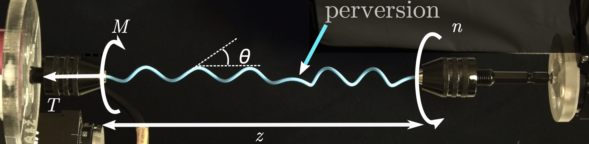
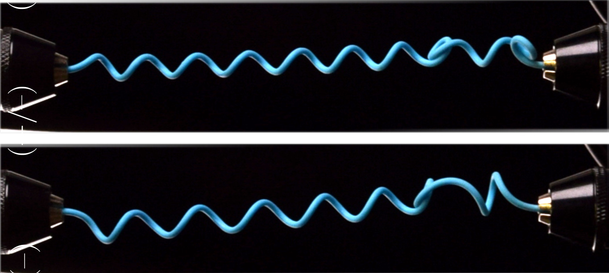

<link rel="stylesheet" href="/css/custom.css">

  Publications

Selected Pubications :

---

  

    
    <h3><a href="paper1/">Mechanical instabilities and snapping phenomena in helical rods</a></h3>
    
Perversions in helical rods exhibit a variety of instabilities...

  

  

    
    <h3><a href="paper2/">Critical phenomena in helical rods with perversion</a></h3>
    
This paper studies critical transitions in rods with perversions...

  

  

    
    <h3><a href="paper3/">Traveling perversion as constant torque actuator</a></h3>
    
Published in PRL 2023. Demonstrates how perversions can propagate under constant torque...

  

---

List of Pubications :

---

- **Dilly**, É., Neukirch, S., Derr, J., & Zanchi, D. (2024). Critical phenomena in helical rods with perversion.
---

- **Dilly**, É. (2024). Helices, perversions and tendrils: from plant-inspired rod mechanics to curvature generation in tendril bearing plants (Doctoral dissertation, Université Paris Cité).
---

- **Dilly**, É., Neukirch, S., Derr, J., & Zanchi, D. (2023). Traveling perversion as constant torque actuator. Physical Review Letters, 131(17), 177201. Editor’s Suggestion
---

- Gianoli, F., Hogan, B., **Dilly**, É., Risler, T., & Kozlov, A. S. (2022). Fast adaptation of cooperative channels engenders Hopf bifurcations in auditory hair cells. Biophysical Journal, 121(6), 897-909.

---

Selected Publications : 
