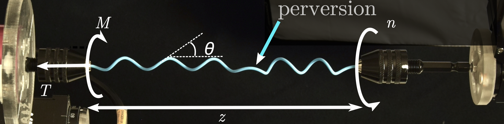

---

##### Figure : Helix unwinding



---

##### Abstract

Mechanical stress and conformation of a helical elastic rod clamped at both ends was studied during the unwinding process. Reducing progressively the winding number from $N_0$ to $-N_0$ by rotation of one clamped end, we followed the conformation of the rod and monitored the torque $M_z$ and the tension $T$ exerted on the clamps, keeping the elongation between clamps constant.

The rod undergoes a complete chirality inversion from $N = N_0$ to $N = -N_0$. The intermediate states are superpositions of two states: one (chirality +) with positive winding number $N_+$ and one (chirality -) with negative winding number $N_-$, keeping $N = N_+ + N_-$. The junction between (+) and (-) is a **perversion**, which migrates along the rod upon changing $N$. 

The process of helix inversion is discussed within a simple model of phase coexistence. The effects of the perversion and of the clamps on the transition are discussed, and minimal theoretical models are proposed.

---


##### Citation

Dilly, É., Neukirch, S., Derr, J., & Zanchi, D. (2023). Traveling perversion as constant torque actuator. Physical Review Letters, 131(17), 177201. https://journals.aps.org/prl/abstract/10.1103/PhysRevLett.131.177201.

```BibTeX
@article{PhysRevLett.131.177201,
  title = {Traveling Perversion as Constant Torque Actuator},
  author = {Dilly, \'Emilien and Neukirch, S\'ebastien and Derr, Julien and Zanchi, Dra\ifmmode \check{z}\else \v{z}\fi{}en},
  journal = {Phys. Rev. Lett.},
  volume = {131},
  issue = {17},
  pages = {177201},
  numpages = {6},
  year = {2023},
  month = {Oct},
  publisher = {American Physical Society},
  doi = {10.1103/PhysRevLett.131.177201},
  url = {https://link.aps.org/doi/10.1103/PhysRevLett.131.177201}
}
```

---

