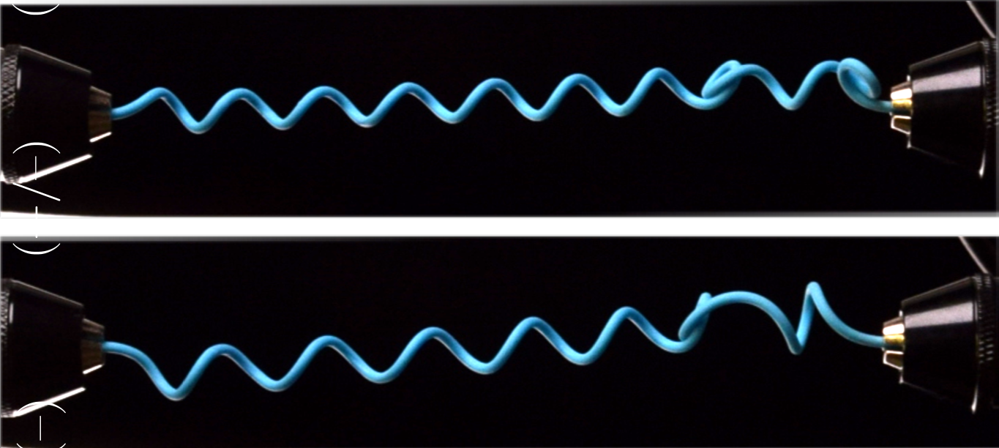

---

##### Singular events during unwinding of a helix destabilize the perversion and may lead to self-contacting conformations.

  

---

##### Abstract

The mechanical instabilities of clamped helical elastic rods under controlled winding and extension, featuring perver- sion, are studied experimentally and theoretically. Perversion appears at a winding lower than the intrinsic one. When the extension and winding are varied, the perversion is involved in three main instabilities. They can all be identified visually as abrupt qualitative modifications of the conformation. Singularities in the axial force and torque acting on the clamps are observed at critical winding and/or extension. (i) Transitioning from a pure helix to a configuration with perversion (and vice versa) is accompanied by a snapping transition. (ii) The perversion jumps to self-contact at critical extension. (iii) At zero net turns, the rod undergoes a writhing transition from a straight to a writhed con- figuration. While the first two transitions are subcritical snaps, the writhing transition is continuous and supercritical. Numerical path-following methods, a shooting technique and finite element simulations are employed to assess the stability of the perversion and the associated snapping towards self-contact. The singularity at the creation of the per- version is reproduced by incorporating clamping effects within path-following methods. An analogy with first-order phase transitions is discussed.

---

##### Citation

Under review 

