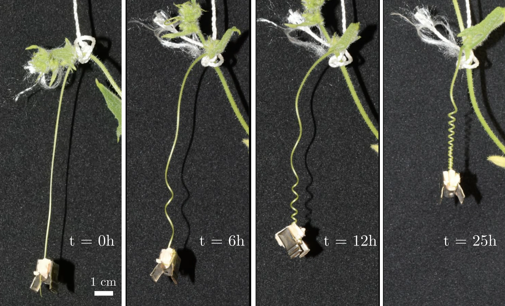

---

##### Writhing of cucumber tendril under fixed force.

<p style="text-align: center;">
  
</p>


---

##### Abstract

We experimentally investigate cucumber tendril writhing, focusing on the dynamics of curvature generation under varying axial forces. At low forces, curvature saturates exponentially at a limiting value. Above a critical force, tendrils fail to coil, revealing two distinct coiling regimes. Growth measurements indicate that curvature arises from differential growth. To capture this behavior, we propose a bi-strip model in which one strip undergoes mechanosensitive growth. In the absence of external constraints, residual stresses within the bi-strip limit curvature generation. Under external force, the tendril is described as a Kirchhoff rod, and a nonlinear analysis of the curvature-generation equations reproduces the two observed regimes: below the critical axial force, the tendril coils; above it, the tendril remains straight, although intrinsic curvature is still present and becomes visible only once the force is removed.


---

##### Citation

Émilien Dilly, Julien Derr, Dražen Zanchi, Internal stress controls tendril writhing dynamics in climbing plants, Proceedings of the National Academy of Sciences, Volume 123, Issue 29, 2026, e2537010123, https://doi.org/10.1073/pnas.2537010123.

```BibTeX
@article{DILLY2026TENDRIL,
title = {Internal stress controls tendril writhing dynamics in climbing plants},
journal = {Proceedings of the National Academy of Sciences},
volume = {123},
number = {29},
pages = {e2537010123},
year = {2026},
doi = {https://doi.org/10.1073/pnas.2537010123},
url = {https://www.pnas.org/doi/10.1073/pnas.2537010123},
author = {Émilien Dilly and Julien Derr and Dražen Zanchi}
}