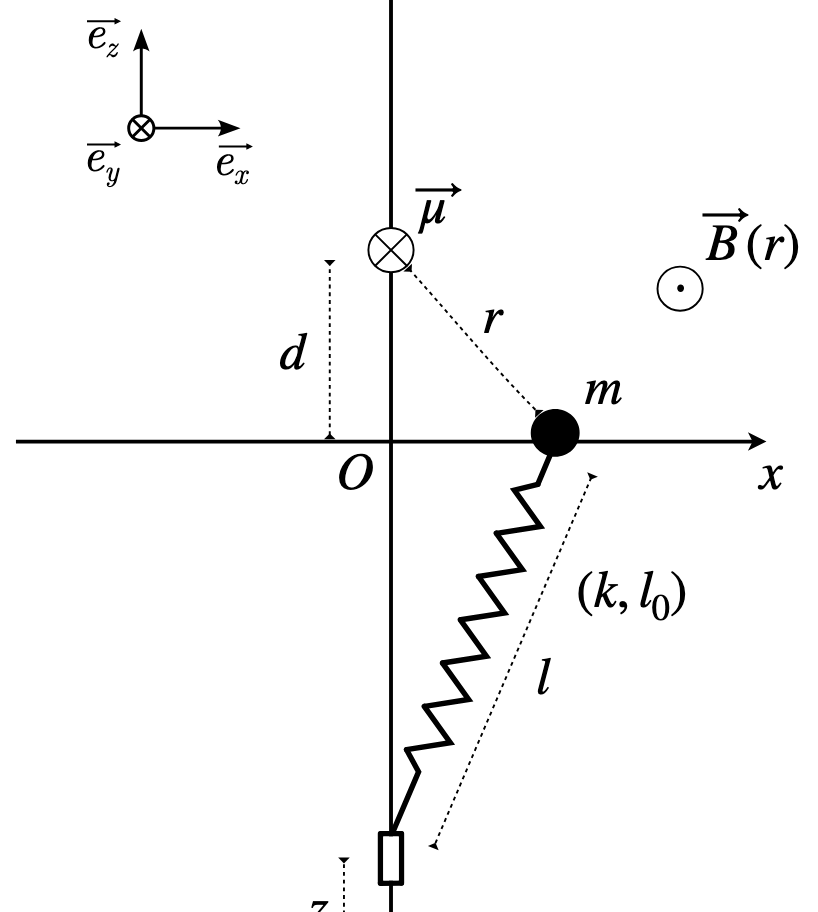
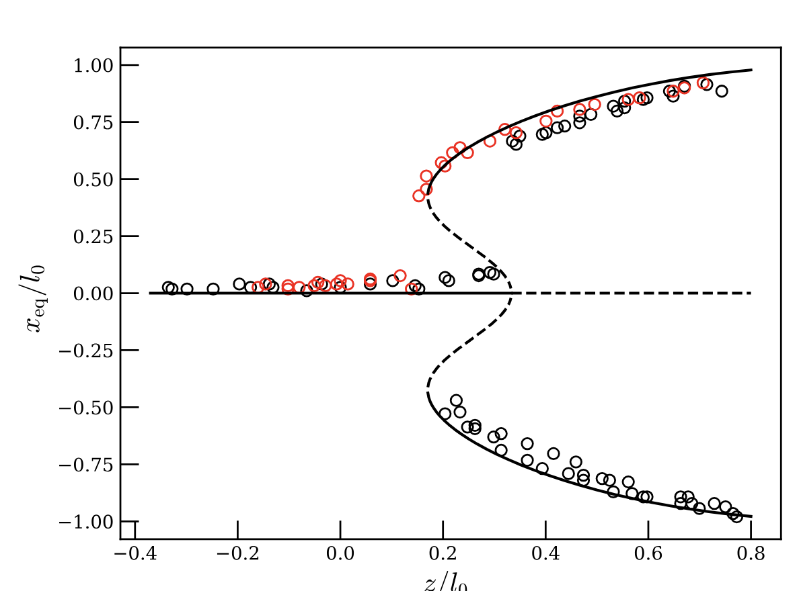

---

##### Schematic representation of the subcritical pendulum. 

  

---

We present a simple mechanical system, composed of a spring, a steel bead, and a permanent magnet, that exhibits a saturated subcritical pitchfork bifurcation.  
The model is analytically tractable, experimentally realizable with inexpensive components, and pedagogically valuable for teaching nonlinear dynamics.  
After deriving the governing equations and reducing them to the normal form, we show that the system can switch between supercritical and subcritical pitchfork bifurcations depending on parameters.  
We then describe a benchtop experiment that reproduces the theoretical predictions, including hysteresis loops and bifurcation unfolding.  
The simplicity of both the analysis and the apparatus makes this an effective teaching tool for courses on dynamical systems and bifurcation theory.  

---

##### Position of the bead as a function of the lower attachement point possition of the spring

  

---

