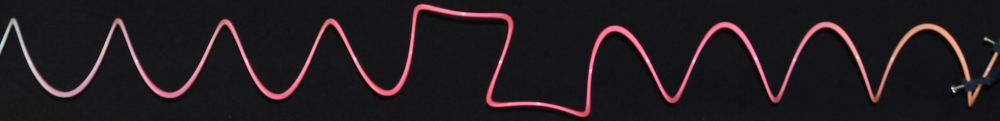
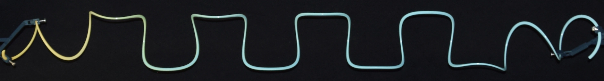

---

##### Helical rod presenting two perversions.

  

---

Helices with multiple perversions can be generated. In the case of two perversions, they interact either repulsively or attractively depending on their separation. Measurements of axial torque show that perversions have discrete equilibrium conformations where the imposed torque is zero and they do not interact. Extending this idea, periodic perversion patterns can be obtained, and their shapes can be solved asymptotically near a straight rod and zero axial force. This analysis reveals that the effective spring constant of such structures can vary significantly from that of the original helix, depending on the cross-sectional geometry and twist-to-bend ratio. 

##### Periodic perversion structures in helical rods

  

---

