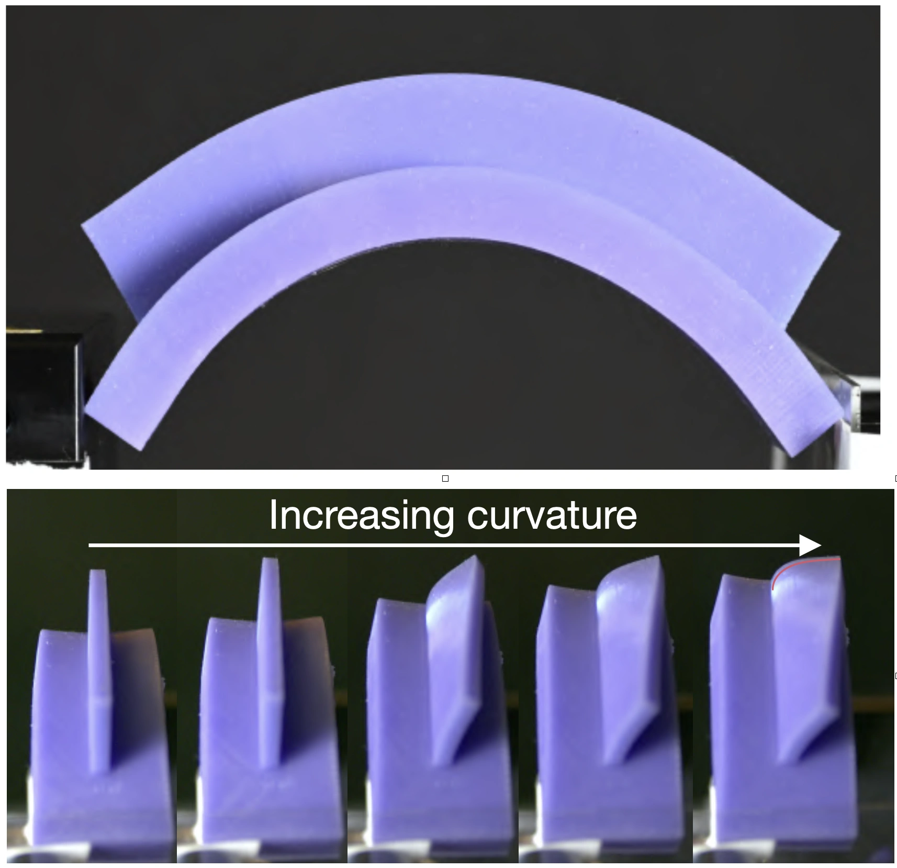

---

##### Bending of a flectofin beam 

  

---

In recent years, architecturing materials at the mesoscale has proven to be an effective way to en- dow them with nonclassical responses, such as auxetic behaviour, couplings between deformation modes (stretching-bending, stretching-twisting), or extreme mechanical properties (high stiffness-to-weight ra- tio). Inspired by the nonlinear bending response of the carpenter’s measuring tape and the pronounced drooping of U-shaped petioles under water stress, we study the bending of a rectangular beam decorated by one or several vertical fin. The bending of the structures results in the longitudinal stretching of the fin, that, coupled with the curvature of the beams, induces a transverse compression in the fin, that buckles above a critical curvature. We rationalize this instability as a function of the geometrical parameters at play. The buckling of the fin induces a sudden reduction of the moment of inertia of the beam, leading to a non monotonic moment-curvature curve, similarly to the carpenter’s tape. When incorporated in pneumatic bending actuators, we show that the fins endow them with a snap-through instability, and hence fast motion and a hysteretic response.

---

##### Bending of a flectofin beam 

  

