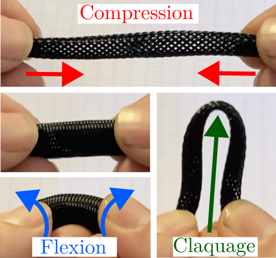
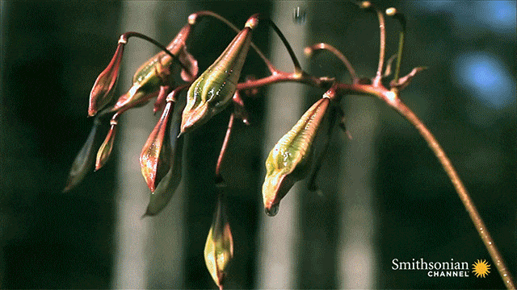
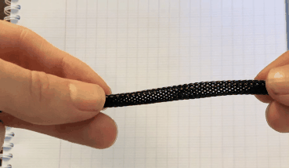

---

##### Schematic representation of the subcritical pendulum. 

  

---

Les instabilités de claquage, ou snapping instabilities, désignent des transitions mécaniques soudaines au sein de structures élastiques soumises à des sollicitations externes. Elles se caractérisent par un basculement rapide d’un état d’équilibre stable vers un autre, souvent accompagné d’un mouvement brusque et d’une libération d’énergie accumulée. Bien que ce comportement puisse apparaître comme une fragilité ou une limitation des matériaux, il constitue en réalité un mécanisme naturel d’une grande efficacité, exploité par de nombreux systèmes biologiques et techniques.

Dans la nature, le snapping permet par exemple à certaines plantes de projeter leurs graines. Inspiré par ces modèles biologiques, le monde de l’ingénierie tire parti de ces instabilités pour concevoir des systèmes performants : actionneurs rapides, dispositifs de déploiement, robots souples capables de mouvements agiles, ou encore solutions de stockage et de restitution d’énergie mécanique.

L’étude de ces phénomènes revêt donc une importance particulière, non seulement pour mieux comprendre les mécanismes d’instabilités dans les structures  composites, mais aussi pour ouvrir la voie à de nouvelles applications en science des matériaux, en robotique et ou encore en conception d’architectures innovantes.

Parmi les nombreuses structures pouvant présenter un snapping, les gaines tressées de fibres hélicoïdales en offrent un exemple : lorsqu’elles sont comprimées et fléchies, elles subissent une instabilité de claquage brutale les déployant. Le stage consistera à réaliser des expériences permettant de caractériser cette instabilité, à mener une étude théorique descriptive du phénomène et à développer une approche de modélisation partant de la structure des fibres élémentaires pour aboutir au comportement macroscopique induit par le tressage. 

---

##### Brutal seed dispersal in *Impatiens capensis*

  

##### Claquage de la gaine tréssée sous flexion-compression

  

---

