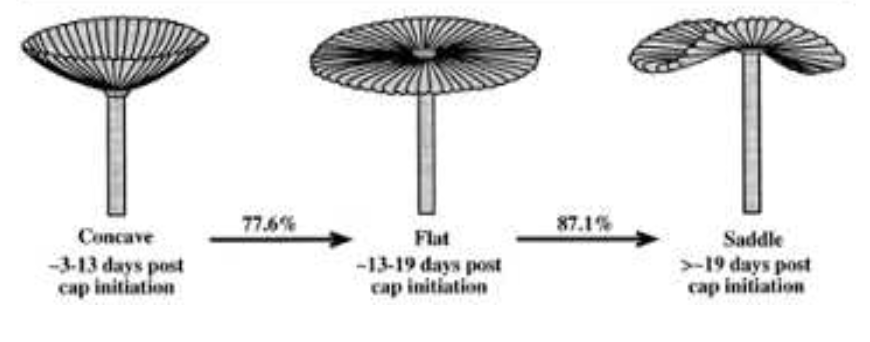
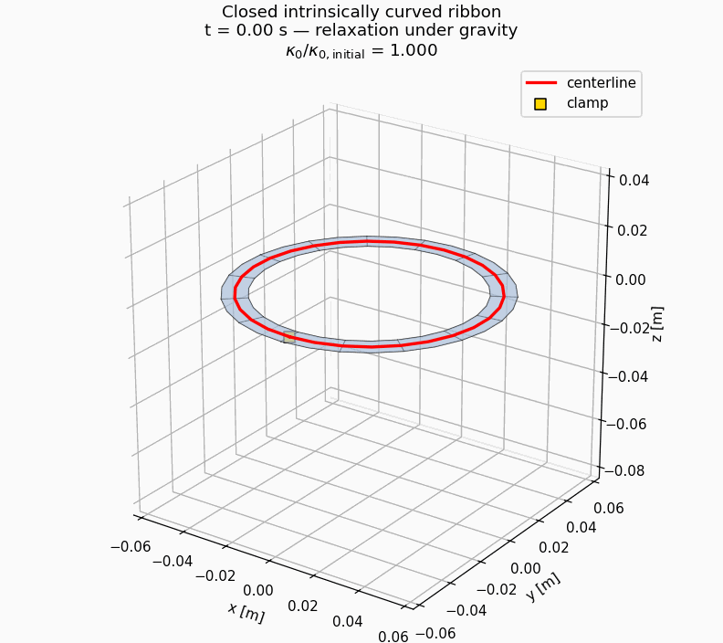

---

##### Frustration géométrique : des plaques aux tiges

  

---

La croissance peut être à l’origine de formes complexes sans qu’aucune force
extérieure ne soit appliquée. Lorsqu’un matériau croît d’une manière incompatible
avec les contraintes géométriques qui lui sont imposées, il ne peut plus réaliser
partout sa géométrie naturelle sans se déformer. Cette **frustration géométrique**
engendre alors des contraintes internes qui peuvent être relaxées par une
déformation hors du plan.

Ce mécanisme intervient notamment dans la morphogenèse des tissus minces.
Une croissance différentielle dans une plaque peut ainsi produire spontanément
des formes tridimensionnelles : cônes, selles ou surfaces fortement ondulées.
Les travaux de Dervaux et Ben Amar sur les tissus élastiques en croissance
illustrent ce mécanisme de façon particulièrement simple : selon la direction
privilégiée de la croissance, un disque initialement plat peut perdre sa symétrie
et adopter notamment une forme de **selle**.

Le projet propose d’étudier expérimentalement une réalisation
unidimensionnelle et minimale de cette même idée : **un anneau élastique
naturellement courbé**.

Une tige possède localement une courbure qu’elle préfère adopter lorsqu’elle
est libre. Mais, une fois refermée sur elle-même, sa longueur et sa courbure
naturelle ne sont pas nécessairement compatibles avec la condition de fermeture.
L’anneau peut alors rester circulaire tout en stockant de l’énergie de flexion.
Lorsque cette incompatibilité devient suffisamment grande, l’état circulaire
plan perd sa stabilité et la tige flambe spontanément dans la troisième
dimension.

Le projet consistera à réaliser des anneaux à partir de tiges minces
naturellement courbées et à faire varier progressivement cette incompatibilité
géométrique. Les étudiants devront mettre au point le dispositif expérimental,
caractériser les propriétés géométriques et mécaniques des tiges, puis mesurer
le seuil d’apparition du flambement ainsi que l’amplitude de la déformation
hors-plan.

L’objectif sera notamment de construire un **diagramme de bifurcation**
expérimental et de comparer le seuil observé aux prédictions d’un modèle de
tige de Kirchhoff. Pour une tige à rigidité de flexion isotrope, le premier mode
non plan attendu est un mode à deux lobes.

Ce système constitue ainsi un modèle expérimental particulièrement simple
pour étudier des mécanismes de frustration géométrique que l’on retrouve à des
échelles et dans des systèmes très différents : tissus biologiques en croissance,
plaques élastiques, coques minces et structures filiformes.

##### Flambement de l'anneau

  

---

---